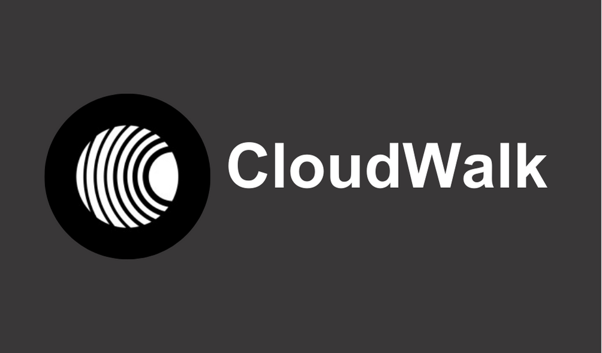

# Versão Brasileira 🇧🇷

<div align="center">
  
  <br/>
  <br/>
  <a href="https://docs.google.com/spreadsheets/d/16Jc8QNSbyZGZLPcl4qIiG32g1b6XNB1tnHzivA0zNcw/edit?usp=sharing" target=”_blank”><strong>Link da Planilha  »</strong></a>
  <br/>
  <br/>
</div>
<div align="center">
<a href="#presentation">Apresentação</a> •
  <a href="#about">Sobre</a> •
  <a href="#technologies">Tecnologias</a> •
  <a href="#run">Como rodar?</a> 
</div>

## <span id="presentation">Vídeo de Apresentação</span>

[Clique aqui](https://www.canva.com/design/DAGAhaA6DBo/K9HKVKbYnA7qgY4CCg8B3Q/view?utm_content=DAGAhaA6DBo&utm_campaign=designshare&utm_medium=link&utm_source=editor)

## <span id="about">🌐 Sobre o Projeto</span>

Este projeto visa a construção de um software antifraude. Os dados são obtidos a partir de um arquivo csv (data.csv), que contém os dados dispostos na [seguinte planilha](https://gist.github.com/cloudwalk-tests/76993838e65d7e0f988f40f1b1909c97#file-transactional-sample-csv).

Os dados obtidos estão sendo considerados como uma análise de um dia anterior, por exemplo, ao invés de uma análise em tempo real da compra, dado que já se sabe que os chargebacks são fraudes.

Para este projeto, foram utilizados os conhecimentos obtidos nas questões anteriores, para criar um antifraude baseado em score.

Os resultados estão localizados [nesta planilha](https://docs.google.com/spreadsheets/d/1CM6NSg6NEwNbMz39hOothevtAs1B9aM9W5-CfDMAupc/edit?usp=sharing).

## <span id="technologies">🛠 Tecnologias</span>

Abaixo seguem as tecnologias utilizadas no projeto: <br/>

<div style="display: inline_block"> 
  
  
  
</div>

## <span id="run">⚙️ Como Rodar</span>

1. Clone este repositório (se certifique de ter o python instalado na sua máquina)

2. Instale as bibliotecas do projeto ([documentação da biblioteca](https://developers.google.com/sheets/api/quickstart/python))

```bash
pip install --upgrade google-api-python-client google-auth-httplib2 google-auth-oauthlib
```

3. Rode a aplicação com

```bash
python3 main.py
```

4. Conecte-se ao email cadastrado (informado no email de entrega do projeto)

5. Pronto! Analise os dados de todos os usuários de uma forma fácil, na planilha de dados. Analise atividades suspeitas de usuários e cartões nas suas respectivas planilhas
